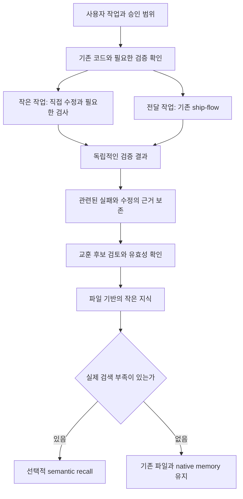

# paul-loop: 사용 현황, 벤치마킹, 경량화 방향

> 2026-09-22 당시의 조사·실행 기록입니다. 당시의 미완료 상태와 다음 작업은 현재 상태가 아닙니다.
> 최신 구현·배포·후속 순서는 [09-23 상태표](2026-09-23-roadmap-status.md)를 따릅니다.
> 원본 출처·편집 범위·비공개 관측 자료는 [보존 목록](2026-09-23-research-archive.md)에 기록했습니다.

기준: **2026-09-22 KST**. 상태: **조사 결과와 로컬 개선안 — 제품 방향 승인·배포·실사용 효용 검증과 구분**.

## 판단

paul-loop의 가장 유용한 자산은 검증 결과와 승인 경계를 에이전트의 자기평가에서 분리한 것이다. 유지할 가치가 있다. 반면 모든 작업에 동일한 계획·리뷰·출판 절차를 적용하거나, 데이터가 쌓이기 전에 별도 메모리 인프라부터 운영하는 것은 현재 근거로 정당화하기 어렵다.

추천 순서는 **upstream의 유효한 변경 반영 → 중복 지침 축소 → 실제 호출·기록 흐름 복구 → 작은 비교 실험 → 효과가 확인된 기능만 확대**다. 이번 변경은 앞의 두 단계를 수행하고, 세 번째 단계의 설계 결함과 평가 방법을 구체화한다.

**후속 관측 완료:** 이 문서와 검증된 경량화 변경을 `fcbfd32`로 보존한 뒤 [실제 host·사용 기록 점검](2026-09-22-native-capability-and-usage-audit.md)을 진행했다. Codex native memory는 활성 상태이며, 세 프로젝트의 완료 turn 23개 중 22개에 인용 흔적이 있었다. 별도 loop-memory 미관측과 구분해야 한다. 현재 설치된 Zine 파생판에는 이번 provider 경량화가 적용되지 않았고, 속도·메모리 효용의 인과 효과는 아직 미측정이다.

**병목 조사 후 우선순위 조정:** [Digging 장기 실행 진단](2026-09-22-long-run-diagnosis.md)에서 전체 검증 재진입과 증거 갱신 순서의 반복을 확인했다. 공유 복구 지침을 보강했으며, 다음은 소비 프로젝트의 검증 진입점·증거 생성·wrapper 호출 정렬이다. 아래의 라우팅·기억 실험 계획은 유지하되 이 확인된 경로를 먼저 해결한다.

| 구성요소 | 확인한 상태 | 우선 조치 |
|---|---|---|
| ship-flow 0.11.0 | upstream과 의도적인 차이가 많고, 전체 전달 경로에 반복 설명이 누적됨 | 기존 계약을 유지하며 지침을 압축. 작은 작업의 진입 선택을 개선 |
| loop-engine 0.15.0 | Rabbit Hole·Digging·Zine에 실제 verdict 이벤트가 있음 | 기존 검증 명령에 붙는 작은 기본 기능으로 유지. 세션 계측과 유용한 반복을 구분 |
| loop-memory 0.7.0 | 조사 범위에서 설치 항목·recall/graduate 이벤트·lesson 파일을 찾지 못함 | 효용 미입증. native/file 기반 비교와 기록 경로를 먼저 해결 |

**“모든 개발 과정에서 잘 사용된다”는 목표는 매번 세 플러그인을 모두 실행한다는 뜻으로 잡지 않는 것이 좋다.** 필요한 순간의 짧은 검증, 재사용 가능한 교훈, 큰 작업의 전달 절차를 각각 제공하는 것이 더 적절하다. 이는 아래 증거를 바탕으로 한 제안이며 아직 실험으로 입증된 제품 결정은 아니다.

## 조사 방법과 범위

- 사용자 요청에 따라 `research-with-aside`를 적용했다. [조사 브리프](2026-09-22-research-brief.md)를 독립 실행 가능한 입력으로 작성하고 `aside exec --effort ultrabrowse`로 웹 탐색을 수행했다. 세션: `9YWQkY8aZHR5NaiI`, Aside 1.26.717.1619.
- Aside가 발견한 핵심 원문을 읽기 전용 웹 도구와 GitHub 소스/API로 다시 확인했다. Aside의 중간 요약·수치·링크를 그대로 사실로 취급하지 않았다. 소스별 원문과 반증을 아래에 함께 기록한다.
- Google의 현재 지원 범위, Exp-SWE-Agent 원문 접근, 9월 harness 논문의 일반화 범위는 별도 Aside 보강 조사(`x2oo4mP88bm0R2Wn`)로 다시 확인했다. 두 조사 모두 정상 종료했다.
- 4·5번 후속 조사는 [별도 브리프](2026-09-22-sections-4-5-research-brief.md)로 Aside 세션 `DN6JJjZlRssvZ8ZM`에서 실행해 정상 종료했다. 핵심 논문, native 문서, 고정 SHA의 Letta·claude-mem 코드/테스트를 다시 읽고 로컬 memory·평가 코드와 대조했다. 이 후속 작업은 문서만 변경했다.
- provider는 `origin/main`과 같은 `791d43b297aefa0c0ba158f6355377dfc2dbf7eb`에서 시작했다. 원본 체크아웃의 기존 미추적 감사 문서는 보존하고 `codex/paul-loop-research-simplify` worktree에서 수정했다.
- 현재 등록된 로컬 프로젝트 9개와 그 Git worktree를 조사했다. 등록 경로 61개 중 실제 존재하는 경로는 27개, 없는 경로는 34개다. 전 디스크·아카이브·DB·다른 `LOOP_DIR`·모든 native memory 저장소를 조사한 것은 아니다.
- 원격 설치·DB 활성화·소비 프로젝트 변경·GitHub 게시·병합·배포는 수행하지 않았다. 현재 소스 버전과 사용자에게 설치된 런타임을 구분한다.

## 1. mattpocock/skills 동기화

2026-09-18 커밋 [`c55ee46073ed923f86ce59a5eb3b6d895095d1b7`](https://github.com/mattpocock/skills/commit/c55ee46073ed923f86ce59a5eb3b6d895095d1b7)을 기준으로 확인했다. 이미 작성되어 있던 9월 22일 vendor 검토와 HEAD가 같았으므로 중복 조사·일괄 덮어쓰기를 피하고, 제안된 변경과 실제 원문을 대조했다.

기존 24개 항목의 검토 분류는 **부분 반영 2, 유지 15, 의도적인 fork 7**이다. 새 후보 14개는 **즉시 채택 0, 보류 4, 불필요 10**으로 기록되어 있었다. 이 숫자는 파일 동일성이나 전체 upstream 기능 도입을 의미하지 않는다.

| 항목 | 처리 | 이유 |
|---|---|---|
| triage | 이미 구현된 동작을 찾는 조사와 근거 보고를 반영 | 기존 구현이 있다는 사실과 기능 거절을 구분. 유사 코드만 보고 버그 재현을 생략하지 않음 |
| prototype | 로직을 검토할 수 있는 단일 HTML 선택지 반영 | 사용자가 터미널 없이 상태·전이를 확인. 브라우저 JS 모델이 원래 언어 구현을 검증했다는 주장은 금지 |
| code-review fork 설명 | 현재 upstream도 병렬 리뷰를 사용한다는 점으로 수정 | 오래된 fork 사유를 정정. 로컬 승인·불완전 리뷰 처리 계약은 유지 |
| tdd·코드 리뷰 | 재사용·표준 기능 우선 원칙을 기존 단계 안에 추가 | 별도 Ponytail 실행 단계를 만들지 않음 |
| implement/to-spec/to-tickets 등 | 통째 이식 보류 | 기존 ship-flow와 겹치는 진입점·계획 산출물 증가를 먼저 피함 |

upstream의 좋은 방향은 작업 크기 분기다. 작은 일은 한 세션에서 구현하고, 긴 일은 독립 검증 가능한 수직 조각으로 나눈다. `/wayfinder`도 큰 불확실성을 다루는 선택지다. 이 방향은 참고하되 특정 컨텍스트 비율이나 upstream의 변경만으로 속도 효과를 주장하지 않는다. [현재 진입 안내](https://github.com/mattpocock/skills/blob/c55ee46073ed923f86ce59a5eb3b6d895095d1b7/skills/engineering/ask-matt/SKILL.md), [티켓 분할](https://github.com/mattpocock/skills/blob/c55ee46073ed923f86ce59a5eb3b6d895095d1b7/skills/engineering/to-tickets/SKILL.md)

로컬 `skills-lock.json`의 변경된 skill hash를 갱신했다. upstream 출처와 의도적인 fork를 유지하는 선택적 동기화다.

## 2. Ponytail에서 가져올 것과 가져오지 않을 것

검토 대상은 **v4.10.0**, 2026-09-14 커밋 [`e3ba2aa6f1e6f0bc4d69eb09c9f0d0a93af56156`](https://github.com/DietrichGebert/ponytail/commit/e3ba2aa6f1e6f0bc4d69eb09c9f0d0a93af56156)이다. 핵심 skill, review/audit/debt/gain 지침과 두 벤치마크 보고서를 읽었다. 설치하거나 원격 실행 코드를 실행하지 않았다.

| 원칙·기능 | 판단 | paul-loop 적용 |
|---|---|---|
| 필요성 → 기존 코드 → 표준 라이브러리 → 플랫폼 → 설치된 의존성 순으로 판단 | 채택 | TDD 구현 단계에서 짧게 적용 |
| 수정 전에 실제 흐름과 모든 호출자를 확인 | 채택 | 증상별 우회 코드를 늘리기 전에 공통 원인 조사 |
| 미래를 위한 추상화·설정·의존성 추가 억제 | 채택 | 현재 요구를 충족하는 가장 작은 구현, 확장 필요가 생겼을 때 재검토 |
| 알려진 한계와 재검토 조건 기록 | 조정 | 실제 한계가 있을 때만 기존 주석·문서 사용. 모든 변경에 debt 문서 생성 금지 |
| 한 줄·최소 LOC 선호 | 조정 | 경계 사례·읽기 쉬움·동작 정확성이 우선. 줄 수만으로 리뷰 finding을 만들지 않음 |
| 비단순 로직에 실행 가능한 검사 | 채택 | 기존 테스트 구조의 의미 있는 회귀 검사. 전체 요구사항을 검사 1개로 제한하지 않음 |
| 지속 persona/hook와 추가 감사·리뷰 모드 | 기본 도입 보류 | 기존 프로세스 위에 또 하나의 상시 계층을 얹지 않음 |
| review의 LOC 절감 점수 | 채택하지 않음 | Ponytail review는 정확성·보안 검토의 대체물이 아님 |
| gain의 일반화된 속도·비용 홍보 | 채택하지 않음 | 모델·과제·실험별 원자료와 제한을 확인해야 함 |

### 벤치마크를 읽은 결과

[6월 18일 agentic 보고서](https://github.com/DietrichGebert/ponytail/blob/e3ba2aa6f1e6f0bc4d69eb09c9f0d0a93af56156/benchmarks/results/2026-06-18-agentic.md)는 Haiku 4.5, Claude Code 2.1.177, 한 FastAPI 템플릿에서 12개 기능 과제를 조건별 네 번 실행했다. 작성자 집계는 추가 LOC **54% 감소**, 토큰 **22% 감소**, 비용 **20% 감소**, 시간 **27% 감소**다. 그러나 생성된 기능을 앱·브라우저에서 실행하지 않았다. 따라서 “작고 저렴한 출력” 근거이며 “동일한 기능 완성도를 유지한 개발 속도” 입증은 아니다. 192개 기능 실행 중 timeout 4개는 비용·시간 집계에서 제외되었다. 별도 보안 과제 5개×4회의 20/20 통과도 전체 보안 보장을 뜻하지 않는다.

[6월 17일 single-shot 비용 검증](https://github.com/DietrichGebert/ponytail/blob/e3ba2aa6f1e6f0bc4d69eb09c9f0d0a93af56156/benchmarks/results/2026-06-17-cost-verification.md)에는 GPT-5.5에서 비용이 **38.7% 증가**한 반례가 있다. 단순 과제의 API 응답 실험이므로 Codex의 실제 저장소 작업 결과로 전이할 수도 없다. 원시 결과가 저장소에 모두 커밋되어 있지 않아 이번에 재계산하지 않았다. `ponytail-gain`의 예전 80–94% 코드·47–77% 비용 감소 설명은 현재 실험과 적용 범위가 다르다.

**해석:** 좋은 구현 원칙은 적은 문장으로 흡수하되, 동일한 persona·hook·수치 주장을 패키지째 복제할 이유는 없다.

## 3. 실제 프로젝트에서 사용되고 있는가

원자료를 집계한 [사용 현황 JSON](2026-09-23-research-archive.md#private-evidence). UTC 2026-08-23부터 9월 23일 미만으로 필터했으며, 실제 관측 시각은 **9월 22일 01:28 KST**다. 아래는 저장소·worktree에 남아 있는 로그에서의 **이벤트 수**다. 독립 작업 수나 성공률이 아니다. run 파일 수는 해당 경로에서 발견한 파일 수다.

| 프로젝트 | 존재 경로/등록 경로 | run 파일 | verdict PASS / FAIL | memory recall / graduate | lesson 파일 |
|---|---:|---:|---:|---:|---:|
| Signal Feed | 8/8 | 41 | 0 / 0 | 0 / 0 | 0 |
| Rabbit Hole | 1/2 | 35 | 86 / 15 | 0 / 0 | 0 |
| Digging | 2/35 | 33 | 389 / 132 | 0 / 0 | 0 |
| Voice Keyboard | 1/1 | 1 | 0 / 0 | 0 / 0 | 0 |
| Zine | 9/9 | 6 | 82 / 23 | 0 / 0 | 0 |
| Mentoring | 1/1 | 6 | 0 / 0 | 0 / 0 | 0 |
| Bathroom Vocab | 1/1 | 0 | 0 / 0 | 0 / 0 | 0 |
| paul-loop provider | 3/3 | 3 | 0 / 0 | 0 / 0 | 0 |
| paul-agents provider | 1/1 | 0 | 0 / 0 | 0 / 0 | 0 |

- **engine이 전혀 사용되지 않는 것은 아니다.** 세 프로젝트에서는 검증 결과를 남기는 경로가 실제 작동했다. Signal Feed와 Mentoring의 세션 이벤트만으로 full ship-flow나 loop-fix를 사용했다고 판단할 수 없다.
- Codex 설정에는 `loop-engine@zine-codex`, `ship-flow@zine-codex` 활성 항목이 있었고 `loop-memory` 항목은 없었다. Claude 설치 기록에는 Zine 범위의 engine/ship-flow가 있고 memory 항목은 없었다. 설정의 존재만으로 모든 세션의 실행을 보장하지 않는다.
- 기존 `liveness`로 Digging의 33개 run 파일을 다시 읽어 recall/graduate 0, 손상 라인 0을 확인했다. Rabbit Hole의 기존 run-metrics는 35개 파일 중 verdict가 포함된 run이 3개라고 보고한다. 101개 verdict 이벤트를 101개 작업으로 계산하면 안 되는 이유다.
- **메모리는 조사 범위에서 사용 증거를 확보하지 못했다.** 이것은 효용이 없다는 결론과 다르다. 삭제된 worktree, 별도 DB, 다른 경로, native memory는 이번 표로 판정할 수 없다.

### 사용을 막을 수 있는 구체적인 연결 문제

1. ship-feature의 구현 단계는 `verdict-run`을 사용하지만, 매번 `loop-fix`와 lesson 기록을 자동 실행하는 것은 아니다. 검증이 많이 발생해도 lesson 파일이 생긴다는 보장이 없다.
2. 검증된 lesson은 FAIL·변경·PASS 증거와 실행 root에 묶인다. 현재 구현은 **같은 Git 저장소의 다른 worktree라도 receipt를 복사해 검증을 승계하지 못하게** 한다. 이 제약은 신뢰 경계이며 제거 대상이 아니다. [lesson receipt 회귀 검사](../../tools/loop-engine/test/lessons-verifier-receipt.test.mjs), [검증 구현](../../tools/loop-engine/lib/lesson-evidence.mjs)
3. loop-memory의 canonical 저장소 identity는 worktree끼리 공유하지만, `graduate`는 worktree에서 `worktree_read_only`로 건너뛴다. 기본 checkout의 source만 기록하는 계약이다. [store](../../tools/loop-memory/src/store.ts), [CLI](../../tools/loop-memory/src/cli.ts)
4. 기존 ship-feature는 merge 뒤 cleanup을 먼저 설명하고 lesson 단계를 뒤에 두었다. 버려지는 worktree의 `.loop` 증거를 기본 checkout으로 적법하게 넘기는 명시적인 경로가 부족하다. 이번에는 필요한 capture·재검증이 남은 경우 삭제를 유예하도록 문서를 보완했다. **영구적인 증거 이관 기능은 아직 구현하지 않았다.**

이 네 항목은 소스에서 확인한 사실이다. 현재 memory 관측치 0의 원인이라고 인과적으로 입증한 것은 아니다. receipt가 현재 HEAD 변화만으로 자동 무효화된다는 주장도 하지 않는다.

관련 기존 이슈도 남아 있다: [#35 실사용 memory hook 증거](https://github.com/reach0908/paul-loop/issues/35), [#87 routine Git sync의 publisher 오선택](https://github.com/reach0908/paul-loop/issues/87), [#98 memory 설정 신뢰 경계](https://github.com/reach0908/paul-loop/issues/98). 9월 22일 읽기 시점에 open이었다. 이번은 이 보안 이슈들을 재감사하거나 해결한 작업이 아니다.

## 4. 2026년 9월의 하네스·컨텍스트·메모리 방향

### 강한 모델이 하네스를 없애는가

가장 직접적인 최신 자료는 **9월 17일**의 [An Empirical Study of Harness Design for Coding Agents](https://arxiv.org/abs/2609.20804)다. 4개 모델, SWE-Bench Verified와 Terminal-Bench 2.1, 176개 설정에서 계획·도구·컨텍스트 관리를 분리했다. 강한 모델에서 계획의 역할은 정확도 보완보다 비용 절약으로 이동했고, bash에 능숙한 모델은 전용 도구 없이도 효율적으로 일했다. 작은 컨텍스트에서는 overflow 방지가 중요했다. 회수 도구를 추가했지만 거의 사용하지 않고 정확도 향상이 없던 조건도 있다. **Nemotron-3 세 크기와 Mistral 한 모델의 preprint**이며 현재 모든 Claude/Codex 모델을 시험한 연구는 아니다. 권한·실행·stuck detection은 고정해 두었으므로 “검증과 안전장치도 제거해도 된다”는 근거가 아니다.

**후속 원문 감사:** 이 논문의 bash-only 비교는 도구 개수뿐 아니라 인터페이스 지침, 파일 상태 추적, 편집 도구의 자동 진단도 함께 바꾼다(§2.2). 효과를 “도구가 적어서”로만 설명할 수 없다. 계획 실험도 명시적인 계획 관리 프로토콜을 비교한 것이지 모델 내부의 계획 능력을 제거한 실험은 아니다. 따라서 우리도 계획·reviewer·memory를 한꺼번에 없애는 비교부터 시작하면 원인을 알 수 없다.

[Evaluating AGENTS.md](https://arxiv.org/abs/2602.11988)의 **6월 23일 v2**는 컨텍스트 파일이 일반적으로 성공률을 개선하지 않으면서 추론 비용을 평균 20% 넘게 늘릴 수 있다고 보고한다. 저장소에서 쉽게 찾을 수 있는 설명을 복제하는 비용과 비표준 실행 명령·필수 제약의 가치를 구분해야 한다. “모든 AGENTS.md 삭제”라는 결론은 지나치다.

따라서 추천은 **모델이 잘하게 된 절차를 재측정하고 덜어내되, 실제 실행 환경·독립 검증·승인·상태 보존은 남기는 것**이다. 현재 ship-flow의 느림을 문서 길이 하나로 설명할 수는 없다. 실제 지연에는 호출된 리뷰 수, 반복 탐색, 승인 왕복, 검증 중복, 도구 응답, 캐시 등이 포함된다.

### 축소를 지지하는 근거와 유지해야 할 반례

| 추가 원문 | 확인한 결과 | 우리에게 남는 질문 |
|---|---|---|
| [execute_code ablation](https://arxiv.org/html/2607.10569), 2026-07, Sonnet 4.6·GPT-5.5 | 계산 93과제·수정 100과제, 각 3회. 도구 표면을 바꾸면 비용 차이가 생겼지만 성공률 차이는 유의하지 않았고 효과가 host/과제별로 달랐음 | Codex의 도구 제한은 프롬프트 기반이고 캐시도 완전 격리되지 않음. “도구를 줄이면 항상 빨라진다”보다 현재 host에서 실제 비용 경로를 확인 |
| [SWE-Review](https://arxiv.org/html/2607.06065), 2026-07-07 | Opus 4.6을 고정한 비교에서 저장소를 탐색하는 리뷰가 고정 diff 리뷰보다 이후 수정에 유용. 동시에 잘못된 재현 테스트·불충분한 범위로 오승인 발생 | 리뷰를 없애기보다 근거를 개선할 가능성. AI 생성 버그 수정 PR 평가이며 UX·migration·보안·최신 모델에 일반화 불가. 여러 전문 reviewer의 추가 효과는 별도 |
| [METR 생산성 실험 설계 갱신](https://metr.org/blog/2026-02-24-uplift-update/), 2026-02-24 | 이전 연구의 감속 결과 뒤 새 표본은 선택 편향·병렬 작업의 시간 측정 때문에 현재 효과를 신뢰성 있게 추정하기 어렵다고 설명 | 벤치마크 해결률, 체감 속도, 실제 사용자 작업 시간을 분리. 과거의 감속 수치를 9월 AI의 효과로 재사용하지 않음 |

리뷰 연구의 실패 원인 분류에는 LLM judge도 쓰였다. 따라서 “PASS라고 썼다”는 관측을 테스트가 오승인의 유일한 원인이라는 인과 주장으로 바꾸지 않는다. 이번 조사에서는 세 연구의 실험을 독립 재실행하지 않았다.

### 공식 자료에서 확인되는 방향

| 출처·날짜 | 확인한 내용 | paul-loop에 주는 시사점·한계 |
|---|---|---|
| [OpenAI Harness engineering](https://openai.com/index/harness-engineering/), 2026-02-11 | 짧은 AGENTS.md를 지도처럼 쓰고 상세 지식을 저장소에 둠. 에이전트가 실행·관찰 가능한 환경 구성 | 큰 상시 설명보다 필요한 문서로 이동. 회사 사례를 통제된 생산성 효과로 해석하지 않음 |
| [OpenAI Skills](https://learn.chatgpt.com/docs/build-skills), 현재 문서 | metadata로 선택 후 필요할 때 상세 skill 로드 | 설치된 모든 SKILL.md의 합계를 매턴 토큰 비용으로 계산하면 안 됨 |
| [OpenAI: GPT-6 Astra의 skills/prompts 재검토](https://learn.chatgpt.com/blog/rethinking-skills-and-prompts-for-gpt-6-astra), 2026-09-11 | 긴 description은 축약되거나 오선택을 유발. 매번 전체 문서 읽기·과도한 검사 독려·넓은 승인 요구를 재검토하도록 권고 | 모델별로 낡은 절차를 재평가할 직접적인 최신 근거. 회사의 사용 지침이며 효과 크기를 입증한 대조 실험은 아님 |
| [Codex Memories](https://learn.chatgpt.com/docs/customization/memories), 현재 문서와 [소스](https://github.com/openai/codex/blob/main/codex-rs/memories/README.md) | native memory의 추출·통합·검색 경로가 존재. 로컬 파일과 점진적인 접근 | 플러그인 DB보다 native 기능을 비교 기준으로 먼저 사용. 현재 기기의 모델/호스트별 설정·효과는 따로 측정 |
| [Anthropic context engineering](https://www.anthropic.com/engineering/effective-context-engineering-for-ai-agents), 2025-09-29 | 필요한 시점의 검색, 압축, 구조화한 노트, 분리된 컨텍스트 | 프로젝트 진입 문서를 짧게 유지하고 필요한 근거만 읽음 |
| [Anthropic long-running harnesses](https://www.anthropic.com/engineering/effective-harnesses-for-long-running-agents), 2025-11-26 | 다중 세션에서 초기 환경·점진 작업·상태 기록·실제 동작 확인 필요 | 긴 작업의 continuity는 여전히 문제. 예전 모델 사례의 효과 크기를 최신 모델로 일반화하지 않음 |
| [Anthropic evals](https://www.anthropic.com/engineering/demystifying-evals-for-ai-agents), 2026-01-09 | 모델+하네스 조합의 최종 환경 상태를 평가. 반복 trial과 적합한 grader | 에이전트가 완료했다고 말한 것과 제품이 동작하는 것을 분리 |
| [Claude Code memory](https://code.claude.com/docs/en/memory), 현재 문서 | repository별 Markdown memory, worktree 공유, index 일부를 먼저 로드 | 파일 기반으로 시작 가능. 공유된 branch별 사실의 충돌·낡은 기억은 별도 관리 |
| [Google Harness engineering](https://developers.googleblog.com/the-anatomy-of-harness-engineering-how-to-evaluate-iterate-and-guard-ai-coding-agents/), 2026-09-09 | 최종 벤치마크와 작은 행동 평가를 보완적으로 사용. 복잡한 작업에서 도구 순서를 경직되게 강제하지 않음 | 잘못된 라우팅·검증 생략 같은 실제 실패부터 작은 평가를 만들고 모델 변경 때 비교 |
| [Google Antigravity CLI 전환](https://developers.googleblog.com/an-important-update-transitioning-gemini-cli-to-antigravity-cli/), 2026-05-19 | 개인용 Gemini CLI 경로를 Antigravity로 통합. 기업·유료 API 경로는 유지한다고 명시 | Gemini 저장소의 최근 커밋과 개인용 제품의 지원 경로를 혼동하지 않음. skill/hook/subagent 등 유지에도 초기 기능 완전 일치는 보장하지 않음 |
| [Gemini CLI Auto Memory](https://geminicli.com/docs/cli/auto-memory/), 문서 갱신 2026-05-13 | 실험 기능은 기본 off. 유휴 세션 분석 결과를 patch/skill 후보로 만들고 사용자가 검토 | 후보 추출과 활성 지침 승격을 분리. 로컬 저장이 모델로의 데이터 전송 부재를 뜻하지 않음 |
| [xAI Grok Build Memory](https://x.ai/news/grok-build-memory), 2026-09-16 | 프로젝트·전역 Markdown memory, 배경 추출·통합, 현재 대화 우선 | 9월 시점 xAI도 지속 기억을 확장 중. 제품 기능 소개이며 독립적인 생산성 효과 검증은 아님 |

공통 방향은 **짧은 진입점, 필요할 때 로드하는 skill/지식, 호스트의 기본 기능, 별도 증거로 측정하는 성공**이다. host가 이미 제공하는 compaction·subagent·memory를 plugin에서 다시 만드는 경우 그 추가 가치를 증명해야 한다. 이 결론은 위 자료를 종합한 설계 제안이다. Gemini의 5월 memory 문서는 설계 패턴의 근거이며 Antigravity에 그대로 제공된다는 근거로 쓰지 않았다.

### 4·5번에서 우선 보강할 여섯 질문

후속 조사는 [별도 브리프](2026-09-22-sections-4-5-research-brief.md)로 범위를 고정했다. 도구 목록 확대보다 아래 질문이 유지·축소 결정을 바꿀 가능성이 크다.

| 순서 | 추가 연구 분야 | 실제로 내려야 할 결정 | 충분한 증거의 기준 |
|---|---|---|---|
| 1 | **모델·호스트·plugin의 역할 경계** | native에 맡길 것과 paul-loop만 보장할 것 | 문서상의 기능, 설치 버전의 기능, 현재 활성 상태를 구분한 표. 필수 검증·프로젝트 합의의 원본 위치 지정 |
| 2 | **실제 지연과 캐시 비용** | 긴 지침·리뷰·반복 검사 중 무엇부터 줄일지 | 같은 작업에서 사용자 대기·모델·도구·리뷰의 시간을 분리. 캐시·출력·실제 과금 관측이 없으면 비용은 미상 |
| 3 | **memory 사용이 끊기는 단계** | 저장·검색·주입 중 어디를 먼저 고칠지 | 설치→trigger→query→관련 hit→주입→실제 활용→검증의 단계별 분모·중단 이유 |
| 4 | **기억의 갱신·폐기와 worktree 이관** | 무엇을 영구 보존하고 언제 무효화할지 | 소스 수정·삭제·상충·다른 branch·worktree 삭제 후 결과. 출처 서명과 현재 유효성을 별도로 판정 |
| 5 | **코딩 과제의 검색 방식·호출 시점** | 파일 검색으로 충분한지, semantic 검색이 필요한지 | 같은 corpus·query·정보 시점에서 비교. 정답이 없는 질의와 검색하지 않는 선택 포함 |
| 6 | **계획·다중 리뷰의 추가 효과** | 어느 위험 수준에서 추가 절차가 필요한지 | 추가 reviewer만 찾아낸 유효 결함, 중복 지적·오탐·시간을 함께 기록. 한 번에 한 구성만 변경 |

1–3은 먼저 조사·관측할 항목이다. 4는 실제 기억을 누적하기 전 필요한 계약이고, 5–6은 작은 비교 실험으로 답할 항목이다. 최신 모델의 지침을 작은 모델이나 다른 호스트까지 일괄 적용하지 않는다.

### 지침 길이보다 실제 대기 경로를 측정

[OpenAI](https://developers.openai.com/api/docs/guides/prompt-caching)와 [Anthropic](https://platform.claude.com/docs/en/build-with-claude/prompt-caching)의 현재 API 문서 모두 재사용되는 prefix와 실제 cache usage를 구분한다. 도구 정의·지침·대화 변경은 캐시 재사용에 영향을 줄 수 있다. 압축은 입력을 줄이면서 기존 prefix도 바꿀 수 있다. **짧아진 Markdown의 비율을 시간·비용 절감률로 바꾸면 안 된다.** API의 계측 가능성이 현재 Codex/Claude 구독형 UI에서 같은 원가를 볼 수 있다는 뜻도 아니다.

추가 플랫폼 없이 task별로 시작/첫 유용한 diff/종료 시각, 사용자 응답 대기, tool/test 구간, reviewer의 추가 발견과 재작업을 기록하면 된다. 병렬 tool/reviewer 시간은 합산해 총 소요 시간으로 쓰지 않고 실제 완료를 지연한 구간을 본다. 기존 [run-metrics](../../tools/loop-engine/bin/run-metrics.mjs)와 [agent-eval](../../tools/loop-engine/bin/agent-eval.mjs)을 먼저 재사용한다. agent-eval은 실행 시간과 결과를 기록하지만 현재 `cost_usd`·`cost_per_accepted_task`는 `null`이다. 단가를 임의로 채우지 않는다.

### Claude Code와 Codex native memory는 동등한 대체재인가

아래는 **09-22에 읽은 공식 문서·공개 소스의 계약**이다. 이 사용자의 모든 host에 같은 버전·설정이 배포됐다는 실측은 아니다.

| 비교 항목 | Claude Code | Codex |
|---|---|---|
| 생성·시점 | 대화에서 유용한 user/feedback/project/reference 기억을 파일로 저장 | 적격한 과거 작업을 유휴 시간 뒤 배경 추출·통합; 활성·짧은 세션 제외 |
| 기본 범위 | 저장소별, 같은 repo의 worktree끼리 공유. 설정으로 경로를 바꿀 수 있음 | 연결된 host의 로컬 memory store; 여러 작업을 통합하는 공유 root. ChatGPT 웹 memory와 별개 |
| 접근 | MEMORY.md의 제한된 앞부분과 필요한 topic 파일 | 생성된 요약·원장·세션 근거를 단계적으로 읽는 경로 |
| 문서상 기본 활성 상태 | auto memory 기본 on, 설정으로 제어 | local memory 기본 off, 활성화 후 사용. 이 사용자의 현재 상태를 뜻하지 않음 |
| 제어 | `/memory`와 설정, 읽을 수 있는 파일의 수정·삭제 | `/memories`에서 현재 작업의 사용·기여를 구분. 생성 파일 직접 편집을 주 제어 수단으로 삼지 않도록 안내 |
| 지속해야 할 팀 규칙 | 프로젝트 지침·체크인 문서 | AGENTS.md·체크인 문서. 자동 기억만을 필수 규칙의 원본으로 쓰지 않음 |
| 아직 보장 못 하는 것 | branch별 사실 충돌·코드 변경 후 교훈의 자동 재검증 | 개별 파생 사실의 정확한 무효화, 사용자 host별 배포·제어 상태 |

근거: [Claude Code memory](https://code.claude.com/docs/en/memory), [Codex memories](https://learn.chatgpt.com/docs/customization/memories), [Codex memory 소스 설명](https://github.com/openai/codex/blob/main/codex-rs/memories/README.md). Claude 문서는 코드/git에서 재발견할 수 있는 사실·일상적인 디버깅 수정의 저장을 피하도록 한다. 따라서 native memory가 receipt를 가진 수정 교훈까지 자동 대체한다고 볼 수 없다. Codex 공개 main의 구현도 모든 안정 릴리스에 포함됐다는 증거는 아니다.

**설계 제안:** 두 host의 생성 memory를 양방향 복사하기보다 프로젝트 합의·검증된 교훈의 원본을 저장소 문서에 두고 host는 필요한 원문을 참조하게 한다. 이것도 검색 효용이 검증되기 전에는 가설이다. 호스트 고유의 전역 선호와 프로젝트 한정 사실을 같은 규칙으로 동기화하지 않는다.

## 5. 메모리 벤치마킹 후보

먼저 저장할 정보의 종류를 나눠야 한다. 현재 loop-memory는 verified lesson 외에도 설정에 따라 ADR·CONTEXT·research·design 문서를 가져올 수 있다. 이번 lesson 파일 0 관측은 이러한 문서나 별도 DB의 전체 corpus가 0이라는 뜻이 아니다.

| 정보 | 적절한 기본 위치 | 유지 기준 |
|---|---|---|
| 현재 작업 상태·blocker·다음 행동 | 기존 issue/작업 문서·세션 handoff | 작업 종료 후 정리. 영구 규칙으로 자동 승격하지 않음 |
| 프로젝트의 비표준 명령·합의·설계 결정 | 짧은 AGENTS/CLAUDE 지도와 ADR·원문 | 실제 코드·현재 결정과 함께 갱신 |
| 반복 실패에서 검증된 수정 교훈 | receipt와 출처를 가진 lesson | 관련 버전·조건과 검증을 유지. 일반 선호를 FAIL/PASS 형식으로 억지 변환하지 않음 |
| 재사용할 조사·사용자 선호 | 출처·날짜가 있는 파일 또는 host memory | 현재 지시 우선, 낡은 사실 재확인, 불필요한 기억 제거 |

아래는 다운로드·활성화 추천 순위가 아니라 구조 비교다. GitHub 원문과 메타데이터를 읽은 시점에 모두 archived=false였고 9월 커밋이 있었다. 활동량은 품질이나 효과의 증거가 아니다.

| 후보 | 현재 구조·운영 부담 | 가져올 점 | 현재 도입 판단 |
|---|---|---|---|
| Claude/Codex native + 저장소 문서 | host 기능과 파일, 별도 vector DB 불필요 | 읽을 수 있는 index, 온디맨드 상세, 기존 사용자 흐름 | **첫 비교 기준**. host마다 의미·격리가 같지는 않음 |
| [Letta Code](https://github.com/letta-ai/letta-code), [memory](https://docs.letta.com/configuration/memory) | 현재는 MemFS/Git 기반 memory, 배경 dreaming·진단; 모델·계정 구성 필요 | diff로 보는 변경, `/doctor`류 중복·예산 점검, 유휴 통합 | 패턴 참고. 오래된 MemGPT 서버 설명만으로 현재 제품을 판단하지 않음 |
| [claude-mem](https://github.com/thedotmack/claude-mem) | hook 관측, Bun worker, SQLite/FTS, Chroma 검색, provider별 모델 호출 | 작은 검색 결과 → 시간 맥락 → 필요한 원문만 조회 | 자동 기록 UX 참고. 추가 서비스·비용·전송 범위 때문에 즉시 교체 보류 |
| [Beads](https://github.com/gastownhall/beads) | 현재 Dolt 중심의 작업·의존성 저장소, embedded/server 방식 | 다음 실행 가능 작업과 blocker를 지속 관리 | 작업 상태용. 검증된 버그 교훈의 semantic memory와 구분 |
| [Mem0](https://github.com/mem0ai/mem0) | 일반적인 장기 memory API·검색 저장소·모델 통합 | identity/scope와 memory 갱신 수명주기 | 채팅 메모리 벤치마크가 우리 개발 효용을 증명하지 않음 |
| [Graphiti](https://github.com/getzep/graphiti) | 시간 정보를 가진 graph, hybrid retrieval, graph 저장소 운영 | 사실의 시점·수정·무효화 | 관계를 여러 단계 따라가는 필요가 생기기 전 graph 도입 보류 |
| [LangMem](https://github.com/langchain-ai/langmem) | memory 추출·검색 도구와 background 처리 SDK, store/agent 통합 | foreground 검색과 background 통합 분리 | 기존 TypeScript/provider를 SDK 때문에 재작성할 이유 없음 |

점검 SHA(축약)/최근 커밋 날짜: Letta Code `b69da0ee`/09-21, claude-mem `4e98d977`/09-20, Beads `5b9e938b`/09-21, Mem0 `a39a802b`/09-18, Graphiti `0de2993c`/09-21, LangMem `9d033b47`/09-09. 살아 있는 문서의 구조는 이후 달라질 수 있다. 특히 Beads를 예전 SQLite/JSONL 구조로, Letta Code를 예전 서버형 MemGPT로만 설명하면 현재 비교가 틀린다.

### 논문에서 빌릴 평가와 빌릴 수 없는 결론

| 원문·버전 | 무엇을 알려주는가 | 제한·우리 평가에 반영할 점 |
|---|---|---|
| [LongMemEval](https://arxiv.org/abs/2410.10813), v2 2025-03-04 | 정보 추출·여러 세션·시간·수정·답변 보류의 500문항 평가 | 채팅 기억 시험. 코드 생산성 근거로 쓰지 않고 갱신·abstention 검사를 차용 |
| [LoCoMo](https://arxiv.org/abs/2402.17753), 2024 | 긴 대화의 QA·사건 요약 등 기억 평가 | 오래된 기초 자료. 프로젝트 코드 재사용과는 다른 과제 |
| [SWE-ContextBench](https://arxiv.org/abs/2602.08316), v3 2026-05-06 | 51개 repo·9개 언어, 기본 1,100과 관련 376과제. 잘 선택·요약한 과거 경험과 불필요한 context의 차이 | 유용한 이전 사례가 주어지는 조건과 실제 검색기를 구분. 무분별한 context는 이득이 제한되거나 해로움 |
| [Accumulated Behavioral Rules](https://arxiv.org/abs/2607.13091), 2026-07-13 | 실제 팀의 11세션에서 review 피드백을 규칙으로 누적한 관측 | 재발 감소 보고는 있으나 대조군 없는 작은 관측. 필수 상시 규칙을 계속 늘릴 인과 증거는 아님 |
| [Memory Poisoning](https://arxiv.org/abs/2606.04329), v2 2026-06-18 | 외부 입력이 지속 기억으로 승격되는 공격 표면 | 자동 수집과 신뢰된 지침을 분리하고 출처·격리·삭제·무효화를 평가 |

현재 읽은 연구만으로 “loop-memory가 사용자 프로젝트의 반복 버그를 몇 % 줄인다”는 수치를 제시할 수 없다. 일반 대화 메모리와 코드 작업 메모리는 평가 단위부터 다르다.

### 검색기를 결정하기 전에 확인할 반례

[SWE-ContextBench v3 §3.3–3.4](https://arxiv.org/html/2602.08316v3)의 Sonnet 4.5/Lite 99과제 비교 표에 보고된 해결률은 과거 context 없음 **26.26%**, 자유로운 요약 검색 **22.22%**, 정답 관련 요약 제공 **34.34%**였다. 같은 표의 OpenViking·Supermemory는 각각 **29.20%·30.30%**여서 검색 시스템의 이득 가능성도 있다. 그러나 표현·검색량·추출 방식이 다르므로 `rg`/BM25/vector/graph 중 어느 한 요소의 승리로 해석할 수 없다. 해당 요약 조건의 평균 비용도 baseline보다 낮지 않았다.

이 논문은 관련 과제 구성에 동일 PR로 해결되는 사례도 포함한다. 우리 파일럿은 미래 수정·정답 diff가 과거 기억에 들어가지 않도록 시간 순서를 별도로 고정해야 한다. 반복 실행의 불확실성까지 독립 재현하지 않았으며 9월 모델의 효과도 미측정이다. **native/file-first는 운영 부담이 적은 비교 기준이지 우월성이 입증된 결론이 아니다.**

### loop-memory에는 무엇이 있고, 무엇을 더 확인해야 하는가

현재 소스를 재확인했으므로 “갱신·삭제 기능이 없다”는 진단은 맞지 않는다.

| 단계 | 이미 존재하는 구현 | 추가로 필요한 관측·결정 |
|---|---|---|
| 검색 시작 | [recall hook](../../tools/loop-memory/hooks/recall-lessons.mjs)은 UserPromptSubmit의 입력 문장을 query로 사용. 8자 미만은 skip | “계속 진행”처럼 문맥 의존 입력에 충분한 query가 생기는지. 작업 시작·오류 발생·명시적 요청 중 어느 시점이 유용한지 |
| 검색 지연 | 동기 child process에 6초 timeout, hook의 `ms` 기록. 실패 시 작업 계속 | fail-open도 응답을 기다리는 시간은 발생. 6초는 전체 end-to-end 상한이 아님. 중앙값·긴 꼬리 지연과 도움을 함께 측정 |
| 검색·주입 | [CLI](../../tools/loop-memory/src/cli.ts)는 query embedding을 공유해 lessons/knowledge를 검색. 주입 건수·문자 수 기록 | 주입은 활용 증거가 아님. 관련 코드·검증·결정에 어떤 영향을 주었는지 확인. 기본 hook에는 선택적인 `--decay`가 적용되지 않음 |
| 갱신·폐기 | [knowledge](../../tools/loop-memory/src/knowledge.ts), [lessons](../../tools/loop-memory/src/lessons.ts)에 content hash, 소스 동기화, 삭제·무효 source 제거, 잠금이 있음 | 동기화가 실제 실행되는지와 실패 후 stale 기간. 유효 서명은 최신 코드에서도 교훈이 맞다는 뜻이 아님 |
| 범위·이관 | [store](../../tools/loop-memory/src/store.ts)는 canonical 경로로 identity를 만들고 worktree는 읽기 공유, 별도 clone은 분리 | cleanup 전에 어떤 근거를 넘기고 canonical에서 무엇을 재검증할지. 단순 remote URL 통합이나 receipt 복사는 해결책이 아님 |
| 활용 측정 | [liveness](../../tools/loop-memory/hooks/lib/liveness.mjs)와 run-metrics에 trigger/검색/주입/skip/error 관측이 있음 | frozen/off 모드는 liveness 쓰기도 억제. 실험에서 로그 부재를 사용 0으로 오인하지 않고 별도 adapter의 관측을 사용 |

따라서 다음 조사는 **저장 기능 추가보다 기존 기능이 사용자의 정상 작업에서 끝까지 연결되는지**를 확인해야 한다. 설치·활성 상태, source 생성, trigger, query, 검색, 실제 활용을 나눠야 “사용하지 않는다”의 원인을 알 수 있다. DB 전체 corpus나 실제 embed/runtime를 이번 후속 조사에서 새로 검사한 것은 아니다.

### 외부 구현에서 가져올 작은 패턴

- **Letta Code:** [고정 SHA의 memory-worktree 구현](https://github.com/letta-ai/letta-code/blob/b69da0ee2aa2afa348e6975055ed804cb127f172/src/agent/memory-worktree.ts)은 `merged`/`no_changes`와 dirty·conflict·failed 상태를 구분하고, 성공한 통합만 transcript 처리 완료로 인정한다. 우리도 교훈 후보 생성과 canonical 수용을 별도 결과로 표시할 가치가 있다. 다만 이 구현은 일부 실패 경로에서 worktree를 정리하고 transcript를 재처리하는 방식이다. paul-loop의 원래 FAIL/PASS 증거까지 이 정리 정책으로 삭제하면 안 된다.
- **claude-mem:** [고정 SHA의 삭제 회귀 검사](https://github.com/thedotmack/claude-mem/blob/4e98d977cc6d9c4fe18c60d4956d948f57e7a1f6/tests/worker/http/routes/data-routes-delete-sync.test.ts)는 observation·summary·prompt 삭제와 동기화 outbox의 tombstone/revision 기록을 함께 확인한다. 향후 복제·동기화를 도입할 경우 삭제도 전달해야 한다는 참고다. 현재 단일 canonical 운영에 cloud sync를 추가할 이유는 아니며, 여기서는 이 테스트를 읽었을 뿐 실행하지 않았다.

두 패턴 모두 출처 변경으로 파생된 모든 교훈이 의미적으로 무효화된다는 보장은 아니다. 코드·테스트의 존재, 출시 버전, 실제 사용자의 운영 성공을 분리해 판단한다.

## 6. 권장 구조와 단계별 작업

아래는 목표 구조다. 새로운 lite/full 모드나 자동 라우터를 이번에 구현했다는 뜻은 아니다.

| 우선순위 | 작업 | 완료 기준 | 이번 상태 |
|---|---|---|---|
| P0 | upstream 유효 변경, YAGNI 원칙, 중복 지침 압축 | 기존 계약·lock·runtime 생성·관련 검사 유지 | 로컬 구현 및 검증 기록은 아래 별도 문서 |
| P1 | 작은 작업이 full ship/publisher로 잘못 들어가는 경로 해결 | routine sync·질문·간단 수정·명시적 PR 요청의 양/음성 routing 사례가 기대와 일치 | #87과 기존 description을 먼저 조사할 다음 조각 |
| P1 | worktree lesson의 영구 보존·canonical 승격 계약 | 다른 root의 receipt를 위조 승인하지 않고 삭제 후에도 출처·내용·상태 추적 | 설계 필요. cleanup 전 증거 보존 문구만 반영 |
| P1 | 실제 반복 실패 6–10건으로 file/native 비교 | 기록→검색→관련성→실제 활용→이후 검증을 끝까지 관찰 | Rabbit Hole·Digging을 우선 후보로 제안 |
| P2 | 리뷰·계획 비용의 비교 실험 | 동등한 품질과 승인 경계에서 시간·비용 감소를 관찰 | 현재 필수 reviewer/gate를 바로 제거하지 않음 |
| P2 | semantic memory 확대 여부 | 충분한 실제 corpus와 file/native 검색의 실패 사례가 있으며 추가 비용보다 이득이 큼 | DB·embedding 활성화 보류. #98 등 신뢰 경계 선행 |

**증거 이관 설계의 선택지:** producer root에서 봉인된 교훈을 검증한 후, canonical 쪽은 출처와 승인된 내용을 담은 별도 handoff로 받아들인다. canonical에서 필요한 동작을 다시 확인하는 경로와 원래 FAIL/PASS의 역사적 증거를 구분한다. 단순 복사로 기존 `verified=true`를 유지하거나 FAIL을 인위적으로 만들어서는 안 된다. root 이동·worktree 삭제·다른 repo·변조·중복 import·실패한 재검증을 포함한 계약이 먼저다.

### 작은 효과 검증 계획 — 아직 실행하지 않음

새 플랫폼 없이 기존 [agent evaluation](../../tools/loop-engine/docs/agent-evaluation.md)과 [native adapter](../../scripts/native-eval/README.md), 작은 CSV/Markdown 표를 재사용한다. 후속 조사에 맞춰 기존 포괄적인 비교를 세 실험으로 좁힌다.

| 실험 | 최소 범위·통제 | 기록·중단 기준 | 어떤 결과가 결정을 바꾸는가 |
|---|---|---|---|
| **A. 느린 구간과 추가 절차의 가치** | 기존 로그로 병목을 먼저 찾고, 작은/일반 과제 4쌍에서 한 절차만 비교. 같은 모델·effort·host 버전·시작 커밋·검증·memory 조건, 순서 교차 | 첫 유용한 diff, 실제 종료, 사용자 대기, tool/test/review 구간, 추가 유효 결함·오탐·재작업. 동등한 품질을 확인 못 하면 축소 결론 중단 | 지연이 주로 test/tool이면 지침 축약 우선순위를 낮춤. 추가 리뷰가 고유 결함을 잡으면 해당 조건에서 유지 |
| **B. 기억이 도움을 주는 조건** | 두 프로젝트에서 2주 동안 실제 교훈 6–10건을 수집하되 미래 정보 제외. 먼저 작은 고정 corpus에서 파일 검색 기준과 한 후보 검색법 비교; 정답 교훈 제공은 상한 확인용으로 분리 | 설치→trigger→query→hit→주입→활용→독립 검증. “계속” 입력, 다른 repo, 낡은 버전, 무관·정답 없는 질문 포함. 문구 인용만으로 활용 판정 금지 | 정답 교훈도 도움이 없으면 저장 가치부터 재검토. 정답은 유용하지만 검색이 실패하면 query/시점부터 수정. 파일 검색이 놓친 유용한 사례가 있어야 semantic 확대 |
| **C. 기억 수명주기와 worktree 이관** | 기존 fixture·임시 root에서 source 수정/삭제/상충, 동시 갱신, worktree 정리, canonical 이관 계약을 확인하는 회귀 시나리오 설계 | 삭제된 사실의 재출현, stale source, 잘못된 repo 매칭, 이관 전후 출처·receipt 유효성. 실제 소비자 DB를 실험용으로 쓰지 않음 | 기존 동기화로 해결되면 실행 경로만 연결. provenance를 안전하게 유지할 수 없는 경우 자동 승격 보류 |

A의 초기 관측이 유망할 때만 기존 제안인 12쌍(24세션)으로 확대한다. 4쌍이나 12쌍을 통계적 우월성의 증거로 보지 않는다. 실용적인 개선 임계치는 시작 전에 정하고, 모든 비교에서 독립적인 요구사항·회귀 검사와 필요한 runtime 관측을 유지한다. LOC는 보조 관측이며 합격 기준이 아니다.

**계측 주의:** 기존 runner의 `memory=frozen`은 학습을 막지만 loop-memory liveness 기록도 막는다. 따라서 frozen 실험은 target adapter가 별도로 관측한 검색·주입 근거가 있어야 한다. 이 환경 변수들이 Claude/Codex의 native memory까지 끈다는 보장도 없다. 분리하지 못한 native 기억은 오염으로 기록하고 인과 효과를 주장하지 않는다. 캐시·토큰·실제 비용을 host에서 얻을 수 없으면 `unknown`으로 남긴다. 유료 모델 실험·consumer memory 활성화는 이번 후속 조사에서 실행하지 않았다.

이 과정을 통과한 후에만 계획과 reviewer 수를 줄이는 새로운 실행 계약을 논의한다. verifier 무결성·고위험 변경·공개 쓰기의 승인 경계는 속도 실험의 제거 대상이 아니다.

## 7. 핵심 주장 원장과 남은 불확실성

| 주장 | 근거 | 종류·신선도 | 신뢰도 / 아직 없는 검증 |
|---|---|---|---|
| engine 사용 흔적이 세 프로젝트에 있음 | [로컬 집계](2026-09-23-research-archive.md#private-evidence) | 관측, 09-22 | 높음 / task 성공·사용자 효용의 증거 아님 |
| 별도 loop-memory 활용 근거를 확보하지 못함 | 같은 집계와 host 설정 | 범위 내 부재, 09-22 | 높음 / DB·삭제된 경로 미조사. 후속 관측에서 Codex native memory 인용은 확인 |
| worktree→canonical 기록에 간극이 있음 | receipt 회귀 검사, store/CLI | 소스 계약, 기준 HEAD | 높음 / 0사용의 인과 관계는 미확인 |
| Ponytail 효과는 모델·과제별로 다름 | 위 두 benchmark 원문 | 작성자 실험, 06-17/18 | 중간 / raw 재실행·실제 제품 동작 확인 없음 |
| 일부 harness 구성의 한계효용이 줄어듦 | [09-17 논문](https://arxiv.org/abs/2609.20804) | 통제 ablation, preprint | 해당 조건 높음 / 최신 모든 상용 모델 일반화 불가 |
| 불필요한 지침은 비용을 늘릴 수 있음 | [AGENTS.md v2](https://arxiv.org/abs/2602.11988) | 실험, 06-23 | 중간~높음 / 사용자 프로젝트 동일 효과 미측정 |
| 최신 host들이 memory를 기본 제품으로 확장 | 위 네 회사 공식 자료 | 기능·설계 사실, 09-22 열람 | 높음 / 각 기능의 독립적인 생산성 효과 미입증 |
| native/file부터 비교하는 것이 적절 | lesson 파일 0·recall 미관측 + 운영 부담 + native 기능 | 본 보고서의 추천 | 중간 / 전체 DB corpus는 미조사. 실제 과제 비교로 반증 가능 |
| 최신 모델에 맞춰 skill description·읽기·승인 지침을 재검토할 필요 | [OpenAI 09-11 지침](https://learn.chatgpt.com/blog/rethinking-skills-and-prompts-for-gpt-6-astra) | 제품 사용 지침 | 높음: 지침 존재 / 우리 작업의 속도·품질 효과는 미측정 |
| memory의 존재보다 선별·활용 방식이 결과를 바꿈 | [SWE-ContextBench v3, 표 4](https://arxiv.org/html/2602.08316v3) | 99과제 비교, 05-06 | 중간 / 최신 모델·시간 순서·동일 검색 예산·반복 불확실성의 별도 검증 필요 |
| 현재 loop-memory에는 source 수명주기 처리가 이미 있음 | §5의 knowledge/lessons/store 소스 | 소스 관측, 09-22 | 높음 / 실제 consumer 동기화 실행·stale 기간은 미측정 |
| 현재 frozen 실험에서 liveness 부재는 사용 0의 증거가 아님 | agent-eval과 liveness의 learning-off 분기 | 소스 관측, 09-22 | 높음 / 별도 adapter 관측과 native memory 조건 확인 필요 |
| 추가 리뷰·도구 제한의 효과는 조건별로 다름 | §4의 SWE-Review·execute_code 원문 | 비교 실험, 2026-07 | 중간 / 다중 reviewer 수·9월 모델·사용자 과제 효과 미측정 |
| Letta의 통합 상태, claude-mem의 삭제 전달에서 작은 패턴을 차용 가능 | §5의 고정 SHA 소스·테스트 | 소스 관측, 09-22 | 구현 존재 높음 / 테스트 재실행·안정 릴리스·실사용 효과는 미확인 |

원문 감사 중 무관한 논문 ID `2502.16113`(대수학), `2504.04748`(네트워크 voter model)을 발견하여 memory 근거에서 제외했다. `Exp-SWE-Agent`의 독립 원문 접근은 실패했다. Aside 보강 조사에서는 DOI 초록을 열었지만 PDF가 403이었고, 상세 interaction-step 수치와 반복·불확실성 보고는 미검증으로 남았다. 따라서 수치를 결론 근거로 사용하지 않았다. 이것이 보고서 전체가 독립 재현 연구라는 뜻도 아니다. 기존 보안 이슈의 해결 여부, 새로운 모델에서의 인과 효과, 실사용 memory hook/DB/embedding은 별도 후속 증거가 필요하다.

이번 실제 변경과 검사 결과는 [구현·검증 기록](2026-09-22-simplification-verification.md)에 정리한다.

자체 개선의 후속 우선순위, 라우팅 변경 및 검증 범위는 [provider 우선순위 실행 기록](2026-09-22-provider-priorities.md)을 참조한다.

4·5번 후속 보강은 문서 내부의 로컬 링크·공백과 `git diff --check`를 확인했다. 코드 변경이 없어 이전 engine/memory suite를 재실행하지 않았다. 새 실사용 속도·메모리 효용 결과가 추가된 것은 아니다.
